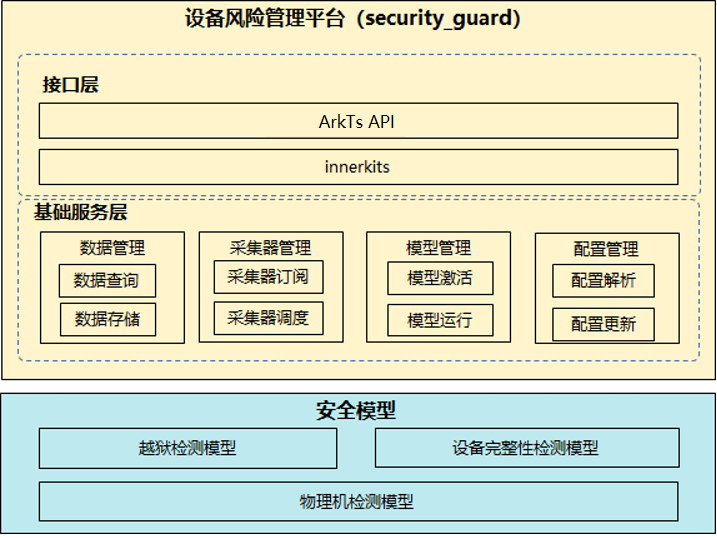

# 设备风险管理平台

- 简介
- 目录
- 编译构建
- 说明

## 简介

设备风险管理平台（SecurityGuard，简称SG）向应用提供风险分析能力，包括root检测，设备完整性检测，物理真机检测等功能。
SG模块可以分为如下三大部分：

- SG 接口层：提供SG API供应用调用。
- SG 基础服务层：实现SG数据管理、模型管理、配置管理、采集器管理等功能。
- SG 安全模型：
  1）越狱检测模型：检测系统是否处于越狱的状态，比如通过分析系统调用表、内核代码段是否会破坏来判断是越狱状态；
  2）设备完整性检测模型：检测设备是否处于完整的未被修改的状态，比如通过分析boot状态是否有异常、设备是否被解锁来判断设备完整性状态；
  3）物理机检测模型：检测当前设备是物理机或模拟器；

SG部件的主要结构如下图所示



## 目录

```
├── build                              # 编译配置文件
├── frameworks                         # 框架代码, 作为基础功能目录, 被interfaces和services使用
├── interfaces                         # 接口API代码
│   ├── inner_api                      # inner api接口
│   └── kits                           # 对外api接口
├── services                           # 服务框架代码
│   ├── config_manager                 # SG 配置管理代码
│   ├── data_collect                   # SG 数据管理代码
│   ├── risk_classify                  # SG 模型管理代码
│   └── security_collector             # SG 采集器管理代码
└── test                               # 测试代码存放目录
```

## 编译构建

以rk3568为例，编译命令如下：

```
./build.sh --product-name rk3568 --build-target security_guard --ccache
```


## 说明

### 接口说明

[接口文档](https://gitee.com/openharmony/docs/blob/master/zh-cn/application-dev/reference/apis/js-apis-securityGuard.md)

### 事件ID编码规则
使用事件ID编码的方式对数据做分类，编码原则如下：
- 按照OH系统、厂商系统（基于OH定制的系统）两个维度定义编码；
- OH系统的编码随社区独立演进，代码合入社区时重新分配编码；
- 厂商系统的编码有厂商自定义演进，不与社区编码重叠

事件ID编码分为三部分组成，每部分采用三位16进制表示：**子系统编码 + 部件编码 + 事件编码**
- 区分OH系统与厂商系统的子系统、部件、事件编码范围：
      OH系统使用： 0x800 – 0xFFF
      厂商系统使用： 0x000 – 0x7FF
- 新增编码从小到大自然增长；

事件ID示例：
```
OH系统（以82c800801编码为例）：
82c ：OH a子系统， 800：OH b部件、 801：OH c事件

厂商系统（以1002003编码为例）：
1 ：厂商 x子系统， 002 ：厂商 y部件、 003 ：厂商 z事件
```

### 模型编码规则：
使用易于开发者使用的字符串标识模型，提供两种分类：
1、Vender厂商预置的，由OpenHarmory定义，由厂商做差异化的能力；
2、EDR类App下发模型，由App做自定义模型的标识；


## 相关仓

**安全子系统**

[security\_security\_guard](https://gitee.com/openharmony/security_security_guard)